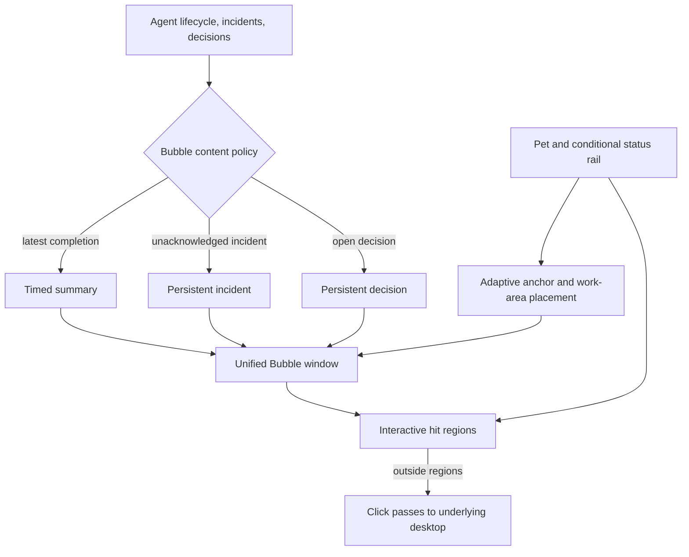
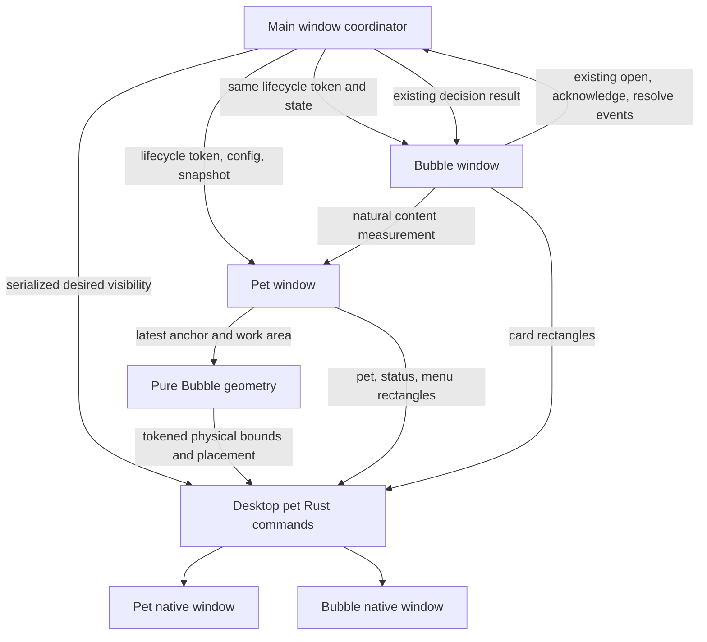
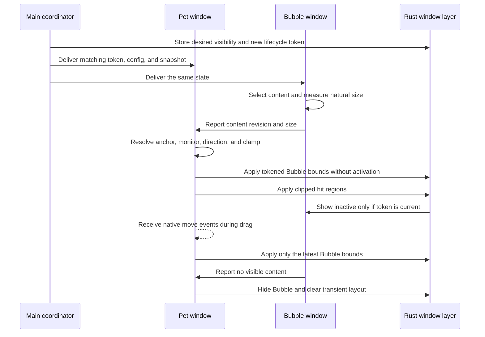
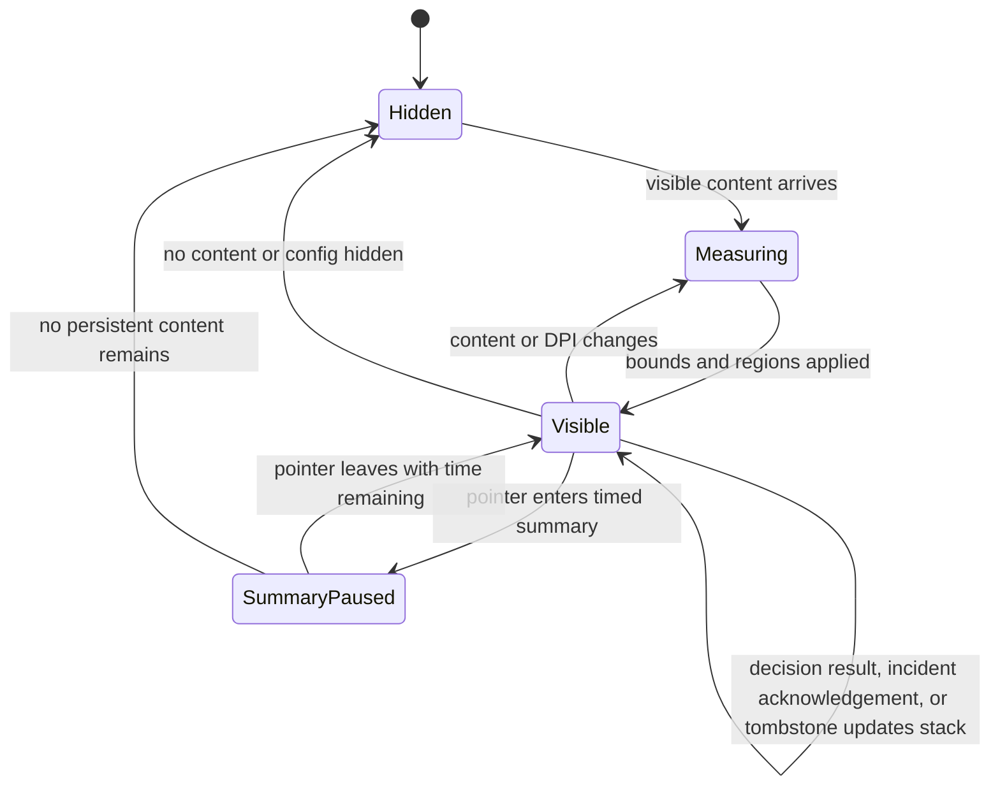
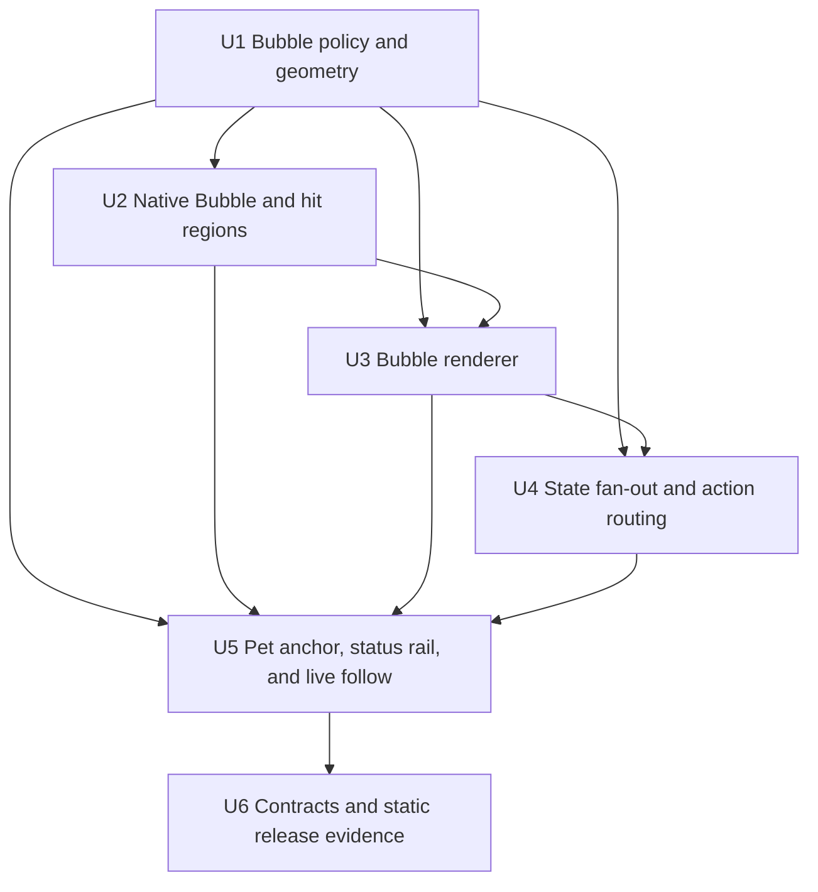

# Desktop Pet Independent Bubble Window - Plan

## Goal Capsule

- **Objective:** 为 CLI-Manager 桌宠增加独立、完整、不会被宠物框裁切的统一 Bubble 窗口，并在 Windows 上让非交互透明区域点击穿透。
- **Product authority:** CLI-Manager 现有多 Agent 桌宠、Pi 决策契约和本计划中的用户确认行为是产品依据；`clawd-on-desk` 仅提供体验参考，不要求复用 Electron 实现。
- **Active scope:** 本计划只负责核心窗口交互，包括 Bubble 内容、保留周期、智能定位、实时跟随、焦点、点击穿透和条件式三色状态轨。
- **Execution profile:** 修改代码、测试源和契约文档，但本轮只执行静态验证；不得安装依赖、编译、运行测试或启动应用。
- **Stop conditions:** 若 Tauri 2.10.3 与现有 `windows-sys` 能力无法提供安全的矩形命中回退，或实现会改变 Agent/Pi 决策语义，停止并向用户报告，不得以自动回答、不可点击窗口或新增未批准依赖绕过。
- **Tail ownership:** 保留本地工作树，不提交、不推送、不创建 PR；用户或 CI 负责计划中标记的编译、测试和真实窗口冒烟门禁。
- **Open blockers:** 无产品或规划阻塞项；运行期可行性由 U2 的安全回退和 Verification Contract 管控。

---

## Product Contract

### Summary

CLI-Manager 将在宠物窗口之外提供一个统一 Bubble 窗口，集中展示关键完成摘要、失败事故和待回答决策。
Bubble 根据完整内容和当前屏幕工作区调整大小与方向，实时跟随宠物，但不主动抢占用户正在使用的终端焦点。

### Problem Frame

当前桌宠将宠物、状态入口和消息卡片放在同一个原生窗口中，即使窗口已能随内容扩展，消息表面仍与宠物窗口的展开、收起和命中区域耦合。
这使透明桌面区域可能阻挡底层窗口，也让宠物靠近屏幕边缘、跨显示器或出现长决策内容时的完整可达性依赖同一个窗口几何。

用户需要的是接近 `clawd-on-desk` 的自由悬浮体验，同时保留 CLI-Manager 的通用多 Agent 状态、后台任务、远程托管和 Pi 显式决策能力。

### Key Decisions

- **统一 Bubble 栈。** (session-settled: user-directed — chosen over per-item and split message/action windows: one native surface keeps focus, ordering, and closure behavior stable.) Governs R1–R5.
- **只承载关键消息与可行动内容。** (session-settled: user-directed — chosen over all lifecycle messages and action-only content: users see meaningful completion context without constant popups.) Governs R2–R4.
- **按消息类型管理保留周期。** (session-settled: user-directed — chosen over all-manual and mostly-auto dismissal: decisions and incidents remain actionable while routine completion summaries clear themselves.) Governs R4.
- **Windows 完整支持，其他平台安全回退。** (session-settled: user-directed — chosen over three-platform parity and Windows-only availability: Windows is the primary release surface without removing the feature elsewhere.) Governs R12–R14.
- **显式命中区域。** (session-settled: user-directed — chosen over per-pixel alpha and whole-window pass-through: the behavior matches Clawd's stable hit-area model and remains compatible with existing pets.) Governs R11–R13.
- **实时跟随且不主动抢焦点。** (session-settled: user-directed — chosen over drag-time hiding, release-time following, and automatic focus: the Bubble stays spatially attached without interrupting terminal input.) Governs R8, R10.
- **状态存在时才显示对应颜色。** (session-settled: user-directed — chosen over persistent zero-count placeholders: the rail reflects only actionable aggregate state.) Governs R15–R16.

<!-- ce-section: work-relationships -->
### How This Work Fits Together

本计划只拥有独立 Bubble 与透明命中这一项核心交互工作；以下是当前理解中的后续候选，不构成已承诺路线图：

- **视觉与主题系统** — Depends on 本计划先稳定宠物与 Bubble 的窗口边界；后续可再对齐主题、配件、粒子和像素样式。
- **自动漫游与边缘行为** — Depends on 本计划建立的锚点、实时跟随和显示器工作区规则；本批不让宠物自行移动。
- **跨平台透明命中一致性** — Can proceed independently after Windows 行为被验证；macOS/Linux 本批使用安全回退。

### Actors

- A1. **桌面用户：** 在终端或其他应用中持续工作，并在需要时查看摘要、处理事故或回答决策。
- A2. **通用 Agent 会话：** Claude、Codex、Grok、Pi 及其他受 CLI-Manager 管理的 Agent，产生状态、完成或失败信息。
- A3. **桌宠表面：** 宠物、三色状态轨和统一 Bubble，共同呈现聚合状态与交互入口。
- A4. **生命周期与决策生产者：** CLI Hook、后台任务、daemon 和 Pi 决策 broker，提供有身份和时间顺序的事件。

### Requirements

**Bubble content and lifecycle**

- R1. 桌宠必须使用一个与宠物渲染表面分离的统一 Bubble 窗口承载本批消息；现有目标、设置和托管菜单继续留在宠物窗口，同一消息卡不得在两个窗口重复显示。
- R2. Bubble 必须展示最近一条完成摘要、全部未确认事故和全部未关闭决策，但不得为普通运行中或工具调用事件持续弹窗。
- R3. Bubble 必须完整呈现标题、正文、问题描述、事故详情、选项说明和回答控件；内容超过当前工作区可用高度时允许内部滚动，但不得使用语义截断、行数裁切或省略号隐藏内容。
- R4. 完成摘要默认显示约 8 秒并在悬停期间暂停计时；事故保留到用户确认；决策保留到回答成功、取消、过期或 broker 关闭墓碑到达。
- R5. 同时存在多类内容时，决策优先于事故，事故优先于完成摘要；现有权限、问卷、问题的决策优先级继续保留。
- R6. 旧事件、重复重放和关闭墓碑不得删除时间更新或身份不同的新卡片，也不得重新显示已关闭决策。

**Placement and visibility**

- R7. Bubble 必须选择当前显示器工作区内可容纳内容最多的方向：宠物靠上时向下展开，靠下时向上展开，靠近左右边缘时向屏幕内侧展开。
- R8. 宠物拖动时 Bubble 必须实时跟随；跨显示器、DPI、缩放、任务栏或工作区变化时必须重新计算锚点、方向和最大可用尺寸。
- R9. Bubble 的定位与扩展不得为了腾出空间而移动宠物，也不得把程序化 Bubble 几何误保存为宠物位置。
- R10. 新 Bubble 只能置顶显示而不能主动激活；用户点击卡片、按钮或输入框后才取得交互焦点。
- R11. 未解决决策和未确认事故必须覆盖宠物关闭、临时隐藏和全屏自动隐藏，并持续提供处理入口；完成摘要遵守用户现有可见性设置，连接丢失时继续遵守原生 UI 回退契约。

**Transparent hit behavior and compatibility**

- R12. Windows 上只有宠物命中区域、可见状态按钮和 Bubble 可见卡片区域能够截获输入，其余透明区域必须把点击传递给下方窗口。
- R13. 命中判断采用显式区域而不是逐像素 Alpha；现有 `.clipet`、Codex Pets、静态图、SVG、GIF/WebP 和 sprite 资源必须继续可用，不要求宠物包新增命中元数据。
- R14. macOS/Linux 无法安全提供同等透明命中时必须回退到现有可交互窗口行为，不能因此隐藏 Bubble、丢失决策或自动作出回答。

**Conditional status rail**

- R15. 绿色、红色和蓝色继续沿用现有状态语义，并分别只在对应聚合数量大于 `0` 时出现；数量归零后对应按钮必须消失，不能保留 `0` 占位。
- R16. 三种数量都为 `0` 时整个状态轨必须消失且不占布局或命中区域；状态轨增删不得导致宠物位置跳动，Bubble 锚点必须使用变化后的实际交互范围。

**Agent scope and decision safety**

- R17. Bubble 和状态轨必须继续聚合所有受支持 Agent，不能把通用桌宠窄化为 Pi 专用表面，也不能削弱现有后台任务、远程托管、任务跳回和 Codex Pets 能力。
- R18. Pi 继续只追加原生生命周期、心跳、最终中断和显式决策桥；问答与权限永不自动决议，普通工具不被拦截，桥不可用或断开时回退 Pi 原生 UI。

### Layout Relationship

### Key Flows

- F1. **关键完成摘要**
  - **Trigger:** 任一受支持 Agent 产生可展示的完成结果。
  - **Actors:** A1、A2、A3、A4。
  - **Steps:** 最新摘要进入 Bubble；窗口在不抢焦点的情况下定位并完整显示；计时在悬停时暂停，结束后摘要消失。
  - **Outcome:** 用户能看到最近完成结果，桌面不会长期被普通通知占用。
  - **Covers R2–R5, R7, R10.**

- F2. **待回答决策**
  - **Trigger:** 决策 broker 打开一个仍可回答的请求。
  - **Actors:** A1、A3、A4。
  - **Steps:** Bubble 覆盖隐藏策略并展示完整问题和选项；用户点击后窗口才取得焦点；成功回答或关闭墓碑移除卡片，桥断开则回退原生 UI。
  - **Outcome:** 未回答请求始终有入口，且没有自动答案。
  - **Covers R3–R6, R10–R11, R18.**

- F3. **宠物拖动与边缘翻转**
  - **Trigger:** 用户拖动宠物，或窗口所在显示器的工作区发生变化。
  - **Actors:** A1、A3。
  - **Steps:** Bubble 实时跟随锚点；布局持续选择屏幕内可用空间更大的方向；宠物位置只由用户拖动结果决定。
  - **Outcome:** 宠物在屏幕任意边缘或显示器上都不会遮断 Bubble 内容。
  - **Covers R7–R9.**

- F4. **透明区域点击穿透**
  - **Trigger:** 用户点击桌宠相关原生窗口覆盖范围内的透明区域。
  - **Actors:** A1、A3。
  - **Steps:** 系统判断点击是否位于宠物、状态按钮或 Bubble 卡片命中区域；区域外点击交给底层桌面窗口，区域内点击进入桌宠交互。
  - **Outcome:** 自由悬浮表面不形成阻挡桌面的透明矩形。
  - **Covers R12–R14.**

- F5. **三色状态条件变化**
  - **Trigger:** 某种聚合状态从 `0` 变为非零，或从非零归零。
  - **Actors:** A2、A3、A4。
  - **Steps:** 只添加或移除对应颜色按钮；三类都为空时移除整个状态轨；重新计算命中范围和 Bubble 锚点但保持宠物位置。
  - **Outcome:** 状态轨只显示当前存在的状态，并且不会留下空占位或导致宠物跳动。
  - **Covers R15–R17.**

### Acceptance Examples

- AE1. **Covers R3, R7.** Given 宠物位于屏幕顶部且决策含长中文正文和多个长选项，when 决策出现，then Bubble 位于宠物下方并向下增长，所有文字和选项完整可达。
- AE2. **Covers R3, R7.** Given 宠物位于屏幕底部且内容高于上方可用空间，when Bubble 展示内容，then Bubble 向上展开并在达到工作区上限后内部滚动，不裁切正文。
- AE3. **Covers R8–R10.** Given Bubble 正在显示且终端拥有输入焦点，when 用户拖动宠物跨越两个不同 DPI 的显示器，then Bubble 实时跟随并重新翻转，终端焦点不被主动夺走，宠物最终位置被正确保留。
- AE4. **Covers R12–R13.** Given Windows 桌宠窗口包含大块透明画布，when 用户点击宠物和 Bubble 命中区域之外的透明位置，then 下方应用收到点击；点击宠物、状态按钮或卡片时由桌宠处理。
- AE5. **Covers R4–R6.** Given 完成摘要、事故和决策同时存在，when 8 秒计时结束，then 只有未悬停的完成摘要消失，事故和决策继续保留，迟到旧事件不能恢复已关闭决策。
- AE6. **Covers R11, R18.** Given 桌宠被用户隐藏且 Pi 打开一个问题，when 决策 broker 仍可用，then 桌宠和 Bubble 恢复为可回答状态；when 消费者断开，then Pi 回退原生 UI 而不是自动选择答案。
- AE7. **Covers R14.** Given macOS/Linux 平台无法提供可靠命中穿透，when 同一决策到达，then 安全回退窗口仍完整展示并允许回答，不因平台差异丢失请求。
- AE8. **Covers R15–R16.** Given 只有两个运行中会话且无事故或待决策，when 状态轨渲染，then 只出现绿色按钮；when 两个会话结束，then 整个状态轨消失且宠物位置不变。
- AE9. **Covers R1–R2.** Given 目标、设置或托管菜单与一个待决策请求同时存在，when 用户打开桌宠交互，then 原菜单继续提供原有操作，决策卡只出现在统一 Bubble 中且不重复渲染。
- AE10. **Covers R4, R11.** Given 用户已隐藏桌宠，when 只有普通完成摘要到达，then 摘要不强制恢复桌宠；when 未确认事故或未解决决策到达，then Bubble 恢复并持续提供处理入口。

### Scope Boundaries

- 本批不实现主题、配件、粒子、像素级视觉复刻或新的宠物资源格式。
- 本批不实现自动漫游、边缘停靠、随机移动或宠物自行避让。
- 本批不实现逐像素 Alpha 命中，也不要求修改既有宠物包以声明命中形状。
- 本批不把所有运行中、工具调用和日志事件转成 Bubble 消息。
- 本批不要求 macOS/Linux 与 Windows 的原生透明命中完全一致。
- 本批不改变现有 Agent Hook、Pi 权限生产者边界、daemon 生命周期或远程托管的产品语义。

### Dependencies and Assumptions

- 现有桌宠状态快照、决策/事故仓库和 Pi broker 继续作为消息身份、时间顺序和关闭状态的权威来源。
- 现有 Tauri 2 与 `windows-sys` GDI/WindowsAndMessaging features 足以实现 `SetWindowRgn` 风格的组合区域；U2 必须保留全矩形 fail-open，并将真实 Windows 行为留给用户冒烟门禁。
- 现有宠物包没有通用命中元数据，因此本批命中范围从已渲染宠物舞台、状态轨和 Bubble 可见区域推导。
- Windows 是完整验收平台；macOS/Linux 的安全回退以“不丢内容、不丢决策、不自动回答”为优先。

### Sources and Research

- `src-tauri/tauri.conf.json` — 当前透明、无框、置顶桌宠窗口配置。
- `src-tauri/src/commands/desktop_pet.rs` — 当前原生桌宠窗口同步、`SWP_NOACTIVATE` 边界写入、显示后修复和 Rust 输入测试入口。
- `src-tauri/Cargo.toml` 与 `src-tauri/Cargo.lock` — Windows target 已锁定 `windows-sys` 0.61，并启用 GDI/WindowsAndMessaging，无需新增原生依赖。
- `src-tauri/capabilities/default.json` — 当前 main 与 desktop-pet 共用的 capability 同时含 SQL、文件、剪贴板、更新器和进程权限，证明 Bubble 必须使用独立最小权限 capability。
- `src/desktop-pet/DesktopPetApp.tsx` — 当前宠物、菜单、决策卡、事故卡和三色状态轨渲染。
- `src/lib/desktopPetMenu.ts` — 当前菜单内容高度与工作区约束规则。
- `src/stores/desktopPetAlertStore.ts` — 当前决策、事故、关闭墓碑和乱序保护状态。
- `src/hooks/useDesktopPetCoordinator.ts` — 当前多 Agent 快照、可行动内容强制可见、fingerprint coalescing、ready 恢复和原生窗口串行同步。
- `src/lib/desktopPetTransport.ts` — 当前稳定快照 fingerprint 与 transport 去重模式。
- `src-tauri/src/claude_hook.rs` — Pi 决策请求、问题、选项、正文和答案的既有数量、长度与身份校验边界。
- `.trellis/spec/frontend/desktop-pet-contracts.md` — 既有桌宠前端行为契约。
- `.trellis/spec/backend/cli-hook-contracts.md` — 既有 Hook、Pi 心跳和显式决策契约。
- `verification.md` — 既有桌宠首次显示、任务栏隐藏、跨 DPI 几何和程序化移动误持久化经验。

---

## Planning Contract

### Product Contract Preservation

Product Contract restructured, no scope change: the former planning-deferred questions are resolved by KTD2–KTD4 and the Verification Contract; R1–R18, A1–A4, F1–F5, and AE1–AE10 retain their prior meaning.

### Key Technical Decisions

- KTD1. **使用静态统一 Bubble 窗口。** 在 Tauri 配置中预创建一个默认隐藏的 Bubble WebView，并由独立 React 入口渲染；不按卡片或事件动态创建原生窗口。 (session-settled: user-approved — chosen over runtime and per-item windows: the user confirmed one preloaded unified Bubble surface.) Governs R1–R5.
- KTD2. **宠物窗口继续拥有锚点和几何真相。** Bubble 只回报自然内容尺寸，宠物窗口复用现有最新请求胜出队列计算并应用 Bubble 边界；主窗口不保存第二份位置。 (session-settled: user-approved — chosen over independently positioned windows: the user confirmed real-time following without a second position authority.) Governs R7–R10.
- KTD3. **Windows 对现有窗口应用多矩形原生区域。** 宠物、可见状态按钮、现有菜单和 Bubble 卡片上报矩形命中区域，由 Rust 合并后限制窗口形状；不增加 Clawd 式输入 WebView，也不逐像素解析宠物资源。 (session-settled: user-approved — chosen over a separate hit window, dynamic whole-window ignore, and alpha hit testing: the user confirmed rectangular hit regions.) Governs R12–R13.
- KTD4. **命中能力必须 fail-open。** 原生区域缺失、无效或应用失败时保留完整矩形可交互窗口并记录诊断；不得应用空区域或让决策入口不可点击。 (session-settled: user-approved — chosen over fail-closed input suppression: the user confirmed a safe interactive fallback on Windows, macOS, and Linux.) Governs R11–R14.
- KTD5. **复用现有快照和事件回路，并显式握手布局。** 主窗口向宠物与 Bubble 扇出同一配置和快照；每次 WebView mount 生成 surface epoch，宠物 ready 后主动请求 Bubble 重发当前 measurement，旧 epoch 或旧 revision 一律丢弃。Bubble 的跳回、确认和决策结果继续通过现有主窗口事件与 broker 命令处理，不建立第二个 Zustand 权威源。 Governs R2–R6, R17–R18.
- KTD6. **内容策略与计时采用稳定身份和源时间。** 纯函数从快照选择最新完成摘要、事故和决策；摘要初始剩余时间由终态 `updatedAt + 8s` 计算，WebView 重载或重复快照不能重新获得完整寿命，悬停只暂停尚未耗尽的剩余时长。关闭墓碑和较新身份继续决定卡片存续。 Governs R2–R6.
- KTD7. **窗口显示顺序固定为测量、定位、命中、无焦点显示。** 每次显示后重新应用 WebView 缩放、任务栏隐藏、Bubble 置顶和最终几何校验；空内容或不可见配置先隐藏 Bubble，再清除本地内容副本、计时与布局状态。 Governs R3–R4, R7–R11.
- KTD8. **当前执行保持静态验证。** 实现必须新增或更新自动化测试源和完整验证矩阵，但本轮不运行编译、测试、安装或应用冒烟命令。 (session-settled: user-directed — chosen over active runtime verification: the standing task constraint requires static-only verification.)
- KTD9. **Bubble 使用独立最小权限 capability。** 不把 `desktop-pet-bubble` 加入同时授予 SQL、文件、剪贴板、更新器和进程能力的现有 `default` capability；新窗口只获得渲染、必要事件、日志和自身窗口交互权限，原生窗口命令同时校验调用方标签与允许操作矩阵。 Governs R11–R14, R18.
- KTD10. **Rust 持有可见性代际，阻断迟到显示。** 主窗口每次原生同步生成新的不透明 lifecycle token，并在同一串行队列中先写入 Rust 的期望可见性、再把 token 发送给两个表面；宠物发出的 Bubble bounds、show 或 region 请求只有在 token 与当前可见代际完全一致时才可生效。 Governs R3, R8–R11.

### High-Level Technical Design

#### Component topology

#### Show and reposition lifecycle

#### Bubble content state

### Implementation Constraints

- 不新增 npm、Cargo 或系统依赖；Windows 区域能力只能使用现有 Tauri 2.10.3、`windows-sys` 0.61.2 和已启用的 GDI/WindowsAndMessaging features。
- 所有跨窗口消息必须带有 surface epoch 以及可比较的内容或布局 revision，并使用最新请求胜出，防止旧 WebView、旧测量覆盖新卡片或新显示器位置。
- 所有可能显示、移动、改变形状或隐藏 Bubble 的原生命令必须携带主窗口最近同步的 lifecycle token；Rust 只接受当前 token，且在期望可见性为 false 时拒绝 show/bounds 请求。
- 所有原生坐标使用窗口本地物理像素；DOM 测量和 Bubble 可滚动高度使用目标显示器逻辑像素，转换时使用目标监视器 scale factor。
- Bubble 位置不持久化；只有宠物折叠锚点可以写回桌宠设置。
- `desktop-pet-bubble` 使用独立最小权限 capability；不得继承现有 `default` capability 中的 SQL、文件、剪贴板、更新器、进程或通知权限。
- 来自 Agent、Hook 或模型的正文只能经 React 文本节点渲染；禁止 `innerHTML`/`dangerouslySetInnerHTML`，也不得把正文、自定义答案或完整事件 payload 写入日志。
- Bubble 不注册 Agent 命令、模型工具或新的决策协议；现有 broker 身份、答案校验和原生回退保持权威。

### Sequencing

### Alternative Approaches Considered

- **每项一个 Bubble 窗口：** 最接近 Clawd 的卡片栈，但会放大 WebView 数量、焦点、排序和墓碑竞态；违反已确认的统一 Bubble 决策。
- **透明渲染窗口加独立输入窗口：** 可复制 Clawd 的 Electron 结构，但 Tauri 下需要转发拖动、右键、状态按钮和菜单输入；Windows 原生多矩形区域能以更少窗口满足 R12–R13。
- **动态切换整窗忽略光标：** API 简单，但窗口进入忽略状态后无法可靠依靠自身指针事件恢复，容易让宠物或决策入口失去交互。
- **继续扩展单一宠物窗口：** 复用最多，但无法解除消息内容、宠物位置和透明命中之间的原生窗口耦合；不满足 R1。

### Risks and Mitigations

| Risk | Impact | Mitigation |
|---|---|---|
| Bubble 被加入现有宽权限 capability | 新 WebView 无必要地获得 SQL、文件、剪贴板或进程能力 | 为 Bubble 创建独立最小权限 capability；default capability 保持现有窗口集合；静态核对权限差集 |
| 跨窗口旧实例、迟到显示或伪造 geometry payload | 隐藏后的 Bubble 被重新打开，旧窗口覆盖新位置，或异常 region 使窗口不可交互 | lifecycle token + surface epoch + revision；过期/未授权请求无副作用，当前请求的 region 失败才 fail-open |
| Agent 文本被当作 HTML 或进入日志 | XSS、敏感内容泄露 | 仅用 React 文本节点；禁止 HTML 注入；日志只记录身份、计数和错误码，不记录正文或答案 |
| Windows 原生区域在 resize 或滚动期间使用旧坐标 | 宠物、菜单或卡片局部不可见，合法 clipped rect 触发整窗降级 | resize 前清除 region；DOM rect 先与 viewport 相交并向外取整；只应用当前 token/epoch/revision |
| 拖动产生高频原生移动事件 | Bubble 抖动、积压或旧位置回写 | `requestAnimationFrame` 帧级合并 + latest runner + trailing apply；位置持久化仍只在现有拖动提交路径发生 |
| Bubble 与宠物 ready 顺序不同 | 首次显示缺状态、旧实例覆盖新测量或单侧重载后不再定位 | surface epoch 隔离实例；宠物 ready 显式请求 Bubble 重发当前 measurement；主窗口强制状态扇出 |
| 跨 DPI 或负坐标显示器转换错误 | Bubble 越界、锚点漂移或尺寸错误 | 统一物理锚点与目标显示器 scale factor；扩充四角、负坐标和多 DPI 纯函数场景 |
| 普通 `show()` 重新注册任务栏或激活窗口 | 出现任务栏缩略图或抢走终端焦点 | Windows 使用 inactive show，并在显示后重设 `skipTaskbar`、100% zoom、topmost 与几何；冒烟验证前台窗口不变 |
| 重复快照或 WebView 重载重启 8 秒计时 | 完成摘要永久不消失 | 以会话和终态时间形成稳定摘要身份，初始剩余寿命源自 `updatedAt + 8s` 并测试重复投递与重载 |
| Bubble 策略读取的 target 时间未进入 snapshot fingerprint | 非当前会话的新完成摘要被去重，或 8 秒寿命使用旧时间 | fingerprint 覆盖每个策略输入字段，新增两个 done target 仅时间顺序变化的 transport 场景 |
| 隐藏 Bubble 仍保留完整正文或输入草稿 | 敏感 Agent 内容停留在不可见 DOM 或内存状态 | 收到不可见配置时清除本地内容、输入和计时；重新显示只从主窗口权威快照恢复 |
| 卡片仍在宠物菜单渲染 | 重复回答入口和几何膨胀 | 将卡片组件迁移到 Bubble，宠物菜单只保留目标、设置、托管和尺寸操作 |
| 原生区域参数异常 | 窗口不可点击或 GDI 资源泄漏 | Rust 端限制数量和坐标，拒绝空/溢出矩形，明确临时与系统接管句柄所有权 |
| 第二个静态 WebView 增加常驻资源 | 隐藏状态仍占少量内存 | Bubble 无内容时停止动画、计时和观察器工作；不创建每卡窗口 |

### System-Wide Impact

- **Window lifecycle:** 从一个桌宠表面扩展为宠物和 Bubble 两个静态窗口；主窗口仍是配置、快照和用户动作协调者，Rust 只持有防止迟到原生操作的当前 lifecycle token 与期望可见性。
- **State authority:** `desktopPetAlertStore`、终端快照和 Pi broker 保持单一内容权威；lifecycle token 只用于窗口代际校验，Bubble 仅持有渲染副本。
- **Agent parity:** 所有 Agent 共用完成摘要和事故表面；Pi 继续使用已有显式决策桥，不增加模型能力。
- **Security and permissions:** Bubble 使用单独的最小权限 capability，不继承主窗口的 SQL、文件、剪贴板、更新器或进程权限；Rust 根据调用方窗口标签、目标窗口和 lifecycle token 限制原生操作。Agent 内容保持 React 转义后的本地文本，不写入新增日志或遥测。
- **Privacy lifecycle:** 用户隐藏桌宠时 Bubble 清除本地渲染副本、输入草稿和计时；重新显示必须从主窗口权威快照恢复，避免完整正文长期留在隐藏 DOM 中。
- **Performance:** 高频路径只传输小型 anchor、measurement 和 revision；移动事件按动画帧合并，React 不在每个原生事件中重建状态快照。
- **Platform behavior:** Windows 获得多矩形点击穿透；macOS/Linux 仍显示独立 Bubble，但保留完整矩形交互回退。

---

## Implementation Units

### U1. Define Bubble policy, retention, and geometry

- **Goal:** 建立可独立测试的 Bubble 内容选择、摘要寿命、条件状态颜色和工作区几何模型。
- **Requirements:** R2–R9, R15–R17; F1, F3, F5; AE1–AE3, AE5, AE8.
- **Dependencies:** None.
- **Files:**
  - `src/lib/desktopPet.ts`
  - `src/lib/desktopPetBubble.ts` (new)
  - `src/lib/desktopPetStatus.ts`
  - `scripts/desktopPetBubblePolicy.test.mjs` (new)
  - `scripts/desktopPetBubbleGeometry.test.mjs` (new)
  - `scripts/desktopPetStatus.test.mjs`
- **Approach:**
  1. 定义 Bubble 窗口标签、ready/measurement/geometry/anchor 事件和物理矩形类型，并保持现有桌宠事件命名风格。
  2. 从快照派生按既有优先级排序的决策、事故和一个稳定身份的最新完成摘要；摘要身份变化时以该终态的 `updatedAt + 8s` 计算初始剩余时间，过期历史摘要不因重载重新出现。
  3. 将悬停暂停、恢复、过期和持久内容共存建模为纯状态转换，不让重复快照延长既有摘要。
  4. 以现有 target-only 菜单约 410 个逻辑像素为 Bubble 首选宽度，最小宽度 280；始终保留至少 12 个逻辑像素工作区边距，并在更窄工作区内继续收缩而不是越界。
  5. 计算四向 placement：完整容纳者优先，否则按可用面积选最大候选；等分时依次偏好上方、下方、屏幕内侧。宠物与 Bubble 保持 12 个逻辑像素间距，无方向可完整容纳时限制 viewport 高度并内部滚动，不修改宠物 bounds。
  6. 提供只返回数量大于 `0` 的状态颜色选择器；当当前 filter 对应数量归零时返回无 filter。
- **Patterns to follow:** `src/lib/desktopPetMenu.ts` 的物理/逻辑坐标转换、四角 placement 与 clamp；`src/lib/desktopPetTransport.ts` 的稳定 fingerprint；`src/lib/desktopPetStatus.ts` 的纯状态解析。
- **Test scenarios:**
  - Covers AE1. 宠物位于顶部四角时，长内容选择下方和屏幕内侧，并保持 Bubble 在工作区内。
  - Covers AE2. 宠物位于底部且自然高度超过可用空间时，几何选择上方并返回受限 viewport，高度不小于可操作控件下限。
  - Covers AE3. 相同逻辑尺寸在 100%、125% 和 150% DPI 及负坐标显示器上保持同一物理锚点。
  - Covers AE5. 重复投递相同完成摘要或重载 Bubble 不会重置到期时间；已超过 `updatedAt + 8s` 的历史摘要不显示；悬停暂停后只恢复剩余时长；事故和决策不受摘要到期影响。
  - Covers AE8. 只有绿色计数时仅返回绿色；计数归零后返回空数组并清除绿色 filter。
  - 多个 done target 同时存在时选择 `updatedAt` 最新项；相同时间使用稳定会话身份打破平局。
  - 宽工作区返回首选 410 逻辑像素；工作区不足 304 逻辑像素时保留双侧 12 像素边距并安全缩窄，不生成横向越界。
  - 同时有多个完整候选时使用稳定 tie-break；全部不足时选择可用面积最大方向并返回内部滚动 viewport。
  - 不完整、非有限或负尺寸输入回退到安全最小值，不能生成 NaN、负窗口尺寸或工作区外坐标。
- **Verification:** 纯函数覆盖内容、时间、宽度与几何边界；所有输出都具有稳定身份、有限坐标和可解释 placement。

### U2. Add native Bubble lifecycle and Windows hit regions

- **Goal:** 创建静态 Bubble 原生窗口，并提供不激活的边界同步、显示隐藏和 Windows 多矩形命中能力。
- **Requirements:** R1, R3, R7–R14; F3–F4; AE1–AE4, AE7, AE9.
- **Dependencies:** U1.
- **Files:**
  - `src-tauri/tauri.conf.json`
  - `src-tauri/capabilities/default.json`
  - `src-tauri/capabilities/desktop-pet-bubble.json` (new)
  - `src-tauri/src/commands/desktop_pet.rs`
  - `src-tauri/src/lib.rs`
- **Approach:**
  1. 增加默认隐藏、透明、无装饰、无阴影、跳过任务栏且初始不聚焦的 `desktop-pet-bubble` 静态窗口；为它创建独立 capability，只授予必要事件、日志和自身窗口交互，绝不把标签加入宽权限 `default` capability。
  2. 扩展桌宠窗口同步，使主窗口在现有串行队列中生成 lifecycle token，并把 token 与期望可见性写入 Rust 状态；禁用或隐藏时在同一临界区隐藏两个窗口并清除自定义 region。
  3. 为 Bubble 增加 token 校验后的物理 bounds、可见性和固定置顶同步入口；Windows 使用不激活的原生显示方式（`SW_SHOWNOACTIVATE`）而不是依赖普通 `show()`，随后重新应用 zoom、任务栏和几何校验，宠物自身 `alwaysOnTop` 设置保持原语义。
  4. 原生命令从 Tauri 注入的调用窗口取得 caller label：主窗口可更新生命周期，宠物窗口可设置 Bubble bounds，各表面只能提交自身命中区域；未知调用方、过期 token 或 target/caller 组合一律拒绝。
  5. 命中矩形必须为无框顶层窗口本地坐标中的有限整数、非负起点和正尺寸，每次最多 64 个；越界、空集、溢出、超量或缺少必要舞台/panel 区域时清除自定义 region 并 fail-open。
  6. 每次窗口尺寸变化前先清除旧 region，应用 bounds 后等待当前布局 revision 再设置新 region；隐藏也清除 region，避免旧形状裁切新尺寸。Windows 使用现有 GDI/WindowsAndMessaging features 合并区域；临时 region 由 Rust 释放，成功交给系统的 region 遵守 Win32 所有权规则。
  7. 非 Windows 返回安全成功并保留完整矩形交互；未知 caller 或过期 token 直接拒绝且不改变当前窗口，当前 token 的矩形验证或 Windows 原生调用失败才清除自定义 region 并恢复完整矩形。
- **Execution note:** 先为所有平台可测的输入验证和回退选择增加 Rust 单测，再接入 Windows 原生调用；不要通过运行应用探索 API。
- **Patterns to follow:** `apply_window_bounds`、`ensure_window_geometry`、`desktop_pet_window_sync` 的 `SWP_NOACTIVATE`、show 后幂等修复和平台 `cfg` 分支。
- **Test scenarios:**
  - Covers AE4. 合法的宠物、状态按钮和菜单矩形通过验证并保持独立区域；透明间隙不被合并为一个大包围框。
  - 空列表、零尺寸、负局部坐标、窗口边界越界、整数溢出和超量区域在当前 token 下恢复完整 region；过期 lifecycle token 和未知 caller/target 组合被拒绝且不改变当前 bounds、可见性或 region。
  - 先隐藏再到达的旧 bounds/show 请求不能重新显示 Bubble；主窗口 WebView 重载后的新 token 能替换旧代际并恢复同步。
  - `desktop-pet-bubble` capability 不含 SQL、文件、剪贴板、更新器、进程或通知权限；现有 default 窗口集合不因本功能扩大。
  - 窗口尺寸变化先恢复完整 region，再应用新 bounds 和新 revision region；多个重叠矩形合并后仍覆盖所有输入区域，临时 region 不会重复释放系统接管句柄。
  - Covers AE7. 非 Windows 分支不调用 Windows API，并保留 Bubble 显示、隐藏和 bounds 同步语义。
  - 隐藏配置同时隐藏两个窗口；重新显示宠物不会在 Bubble 无内容时误显示 Bubble。
  - Bubble 显示前后的前台窗口句柄保持不变；显示后重新应用任务栏隐藏和 100% zoom，bounds 写入不激活窗口。
- **Verification:** Rust 输入验证、lifecycle token、caller/target 授权矩阵、inactive show 与 region 事务可静态追踪；所有失败路径保持窗口可交互，Bubble capability 不继承任何无关权限。

### U3. Build the independent Bubble renderer

- **Goal:** 将决策和事故卡迁移到独立 Bubble，并新增不截断的完成摘要、测量和内部滚动行为。
- **Requirements:** R1–R6, R10–R11, R17–R18; F1–F2; AE1–AE2, AE5–AE7, AE9–AE10.
- **Dependencies:** U1, U2.
- **Files:**
  - `src/main.tsx`
  - `src/desktop-pet/DesktopPetBubbleApp.tsx` (new)
  - `src/desktop-pet/DesktopPetAlertCards.tsx` (new)
  - `src/desktop-pet/DesktopPetApp.tsx`
  - `src/desktop-pet/desktopPetBubble.css` (new)
  - `src/desktop-pet/desktopPet.css`
  - `src/lib/i18n.ts`
  - `scripts/desktopPetBubblePolicy.test.mjs`
  - `scripts/desktopPetBubbleGeometry.test.mjs`
- **Approach:**
  1. 按当前窗口标签在前端入口加载 Bubble 应用；宠物窗口继续加载原应用，主窗口路径不变。
  2. 将决策和事故卡及其提交失败状态抽到共享卡片模块，但只在 Bubble 渲染；从宠物菜单删除对应卡片和相关几何计数。
  3. Bubble 使用 U1 的策略构造“决策、事故、最新完成摘要”栈；不渲染普通运行或工具事件，所有 Agent/Hook 字段都通过 React 文本节点输出，不引入 HTML 渲染路径。
  4. 使用自然 `scrollHeight` 和宽度测量完整卡片；超过几何返回的 viewport 时只让内容容器滚动，不给正文、选项或标题设置 line clamp。
  5. 用稳定摘要身份和源 `updatedAt` 驱动最多 8 秒的初始寿命；pointer enter/leave 暂停和恢复，窗口隐藏、WebView epoch 替换或内容替换时清理计时器、输入草稿、内容副本与监听器。
  6. 每次 mount 生成新的 surface epoch；内容或自然尺寸变化发送该 epoch 下递增的 measurement revision，接收匹配 epoch 的 geometry revision 后才更新 placement、箭头方向、viewport 和命中区域。
  7. Bubble 初始不取焦点；按钮和输入框保持原有键盘、ARIA、提交失败及自定义答案行为，完成摘要使用 polite status 语义，事故与决策具有可读标题关系。移除当前聚焦卡片时将焦点移到下一张可行动卡，栈为空则隐藏窗口；日志只记录请求身份和结果码，不包含正文或答案。
- **Patterns to follow:** 当前 `DesktopPetDecisionCard`、`DesktopPetIncidentCard` 的答案语义和本地化；Clawd 的“自然高度上报后再定位”体验；现有 CSS 的 `overflow-wrap:anywhere` 与 workspace-bounded scrolling。
- **Test scenarios:**
  - Covers AE9. 决策和事故只在 Bubble 出现，宠物菜单仍显示目标、设置、托管和尺寸操作。
  - Covers AE1–AE2. 长中文、英文、emoji、无空格字符串、长选项描述和多问题问卷都保留完整文本；只有工作区受限时出现内部滚动。
  - Covers AE5. 完成摘要到期只删除摘要，不能删除事故或决策；悬停期间计时暂停，重复快照不延长寿命。
  - Covers AE6. 桥接提交失败时卡片保留并显示可重试错误；成功结果或关闭墓碑只移除对应 request。
  - 零问题、固定选项、自定义输入和 4,000 字符上限继续遵守既有 Pi 结果语义。
  - Bubble 无内容、配置不可见、surface epoch 替换或窗口卸载时取消 ResizeObserver、计时器和事件监听，并清除正文和自定义答案的本地副本。
  - 包含 HTML 标签、事件属性、URL 和控制字符的 Agent 文本按字面文本显示，不创建 DOM 节点、导航或脚本执行；诊断日志不含正文和答案。
  - Bubble 出现不会移动终端焦点；鼠标点击后 Tab 顺序覆盖当前可行动控件；移除已聚焦卡片时下一张卡可继续操作，栈为空时窗口安全隐藏。
  - 完成摘要以非打断的状态语义播报，事故和决策的标题、说明、问题和错误状态可被辅助技术关联。
- **Verification:** Bubble 源码中不存在语义截断、HTML 注入、敏感内容日志或重复卡片路径；焦点与可访问语义覆盖显示、交互、移除和空栈状态；所有用户动作仍回到既有主窗口事件与 broker。

### U4. Fan out state and route Bubble actions

- **Goal:** 让主窗口可靠地向两个表面同步状态，并把 Bubble 操作送回现有会话、事故和 Pi 决策链路。
- **Requirements:** R2, R4–R6, R11, R17–R18; F1–F2; AE5–AE7, AE10.
- **Dependencies:** U1, U3.
- **Files:**
  - `src/hooks/useDesktopPetCoordinator.ts`
  - `src/lib/desktopPetTransport.ts`
  - `src/lib/desktopPet.ts`
  - `scripts/desktopPetTransport.test.mjs`
- **Approach:**
  1. 将双目标投递判定、surface epoch 接受规则和 lifecycle token 匹配提取为 `desktopPetTransport.ts` 纯逻辑，React hook 只负责采集当前状态和执行 Tauri 调用；snapshot fingerprint 必须包含 Bubble 策略实际读取的每个字段，尤其是每个 target 的 `updatedAt`。任一目标投递失败时不提交 fingerprint，下一轮可重试。
  2. 主窗口原生同步队列每次生成新的 lifecycle token，先调用 Rust 原子更新期望可见性，再把含同一 token 的配置扇出到宠物与 Bubble；普通快照更新复用当前 token，不能绕过该顺序直接触发 Bubble show。
  3. 为两个表面使用带随机 surface epoch 的独立 ready 事件；任一表面重载都触发一次新的 lifecycle token、原生同步和强制状态恢复，但 Bubble ready 不重置宠物几何或展开菜单。
  4. 宠物 ready 后向 Bubble 发出 layout request；Bubble 即使内容身份和 DOM 尺寸未变，也必须回送当前 epoch、measurement revision、lifecycle token 和自然尺寸，关闭首次加载及单侧重载丢事件窗口。
  5. 配置转为不可见时立即清空已发送快照 fingerprint；Bubble 收到隐藏配置后清除本地内容与输入草稿，重新显示只接受主窗口新快照。
  6. 新事故或决策继续强制宠物可见并发送状态，但不再向宠物窗口发送“展开行动卡”事件；Bubble 根据快照自行显示。
  7. 跳回、事故确认和决策 resolve 事件仍由主窗口处理；决策成功或失败结果发送到 Bubble，store 只在 broker 成功后移除请求。
  8. 心跳、决策重放和关闭墓碑继续先由现有 store 消费，不进入 Replay、toast、任务栏或第三方通知。
- **Patterns to follow:** 当前 `sendState` 的 coalescing/fingerprint、`windowSyncQueueRef` 串行化、READY 强制恢复和 broker 成功后移除决策的顺序。
- **Test scenarios:**
  - Covers AE10. 隐藏同步完成后，携带旧 lifecycle token 的 bounds/show 请求被拒绝；普通完成不强制恢复，事故或决策生成新 token 后必定收到最新快照。
  - 同一快照向两个标签各投递一次；其中一个投递失败时 fingerprint 不前移，重试后两个表面收敛。
  - 两个已完成 target 只有 `updatedAt` 先后顺序变化时 fingerprint 也必须变化，并使 Bubble 选择新的最新完成摘要；完全相同的重复快照仍被去重。
  - 主窗口、宠物或 Bubble 单侧重载都会建立新 token；旧 token 下的 ready、measurement、geometry result 和 decision result 不能改变新实例可见状态。
  - 宠物 reload 后的 layout request 能取回当前 Bubble measurement；Bubble reload 后的新 measurement 能重新建立 geometry，二者都不展开菜单或覆盖用户拖动位置。
  - Covers AE6. 决策成功时 store 和 Bubble 同步移除；失败时 Bubble 收到失败结果并保留卡片。
  - 重复 tombstone、重复 heartbeat 和重复 decision replay 不产生普通通知副作用或重复卡片。
  - daemon-only 事故跳回继续先 attach 后激活，Bubble 迁移不改变恢复顺序。
- **Verification:** 两个窗口的状态交付可由纯 transport 规则、同一 fingerprint、lifecycle token、独立 surface epoch 和显式 layout handshake 解释；主窗口仍是唯一动作协调者。

### U5. Anchor Bubble, report hit regions, and hide empty status colors

- **Goal:** 让 Bubble 在拖动、菜单、尺寸、DPI 和状态轨变化时实时跟随，并让 Windows 只截获实际交互区域。
- **Requirements:** R7–R17; F3–F5; AE1–AE4, AE7–AE8.
- **Dependencies:** U1–U4.
- **Files:**
  - `src/desktop-pet/DesktopPetApp.tsx`
  - `src/desktop-pet/DesktopPetBubbleApp.tsx`
  - `src/desktop-pet/desktopPet.css`
  - `src/desktop-pet/desktopPetBubble.css`
  - `src/lib/desktopPetBubble.ts`
  - `src/lib/desktopPetMenu.ts`
  - `scripts/desktopPetBubbleGeometry.test.mjs`
  - `scripts/desktopPetMenuGeometry.test.mjs`
  - `scripts/desktopPetStatus.test.mjs`
- **Approach:**
  1. 宠物应用按 Bubble surface epoch 保存最新 measurement，并复用 latest async runner 计算和应用 geometry；旧 epoch、旧 measurement、旧 monitor 结果和旧 placement revision 不得覆盖新状态。
  2. 用户拖动期间以 `requestAnimationFrame` 合并 native move 事件，每个渲染帧最多安排一次 Bubble reposition；latest async runner 只应用最新锚点，并在移动事件短暂停止后补一次 trailing apply。宠物位置仍只由现有延迟提交路径持久化。
  3. 菜单展开、收起和尺寸预览继续维护折叠宠物 anchor；任何会改变窗口尺寸的操作先由 Rust 清除旧 region，Bubble 使用 anchor 而不是扩展菜单窗口左上角，避免程序化几何被误存。
  4. 监视器、scale factor、工作区、状态轨和 Bubble measurement 变化都触发重新定位；目标显示器变化时使用该显示器逻辑 viewport。
  5. 状态轨先过滤 count 为 `0` 的颜色，并绝对定位在固定宠物舞台内；全部为空时不渲染 nav，当前 filter 消失时恢复无 filter，外层窗口 bounds 和宠物 anchor 均不变化。
  6. 宠物窗口采集宠物舞台、每个可见状态按钮和展开菜单的 DOM rect；Bubble 采集可见 panel/card rect。每个矩形先与本窗口 viewport 相交并丢弃完全裁切项，再按自身 scale factor 向外取整为窗口本地物理像素，携带 lifecycle token、surface epoch 与布局 revision 向 Rust 上报。
  7. 矩形或 token 上报失败不关闭交互；非 Windows 保留完整窗口行为。
- **Patterns to follow:** `menuWindowTaskRef` 的最新任务语义、`collapsedWindowGeometryRef` 的底部中心锚点、`expectedProgrammaticPositionRef` 的移动过滤和现有四角几何测试。
- **Test scenarios:**
  - Covers AE3. 一帧内的移动突发只调度一次位置写入，持续拖动跟随当前帧锚点，停止后 trailing apply 使用最终位置；持久化值仍是折叠宠物坐标。
  - 菜单打开与关闭时旧 region 在 resize 前被清除；尺寸从 40% 到 150% 时保持宠物底部中心并更新 gap。
  - Covers AE1–AE2. 顶部、底部、左右边缘、任务栏缩小工作区和负坐标显示器都选择可用空间更大的方向。
  - Covers AE8. 单色、双色、三色和全零状态只渲染非零按钮；选中颜色归零后 filter 被清除且宠物不跳动。
  - Covers AE4. 上报区域逐项包含舞台、按钮、菜单和 Bubble panel，不把透明间隙扩大为总包围框；部分滚出 viewport 的卡片先被裁切，向外取整后不产生 1 像素不可点击边缘或越界拒绝。
  - ResizeObserver、菜单 revision、lifecycle token、surface epoch 与拖动事件并发时，只有当前可见代际和当前实例的最新 geometry 与 hit-region revision 生效。
- **Verification:** 位置真相、lifecycle token、surface epoch、布局 revision 和命中区域各有单一所有者；高频移动有帧级上限；没有 Bubble 坐标写入设置的路径。

### U6. Update contracts and static release evidence

- **Goal:** 让前后端契约、功能说明、变更记录和验证记录与两窗口行为一致。
- **Requirements:** R1–R18; F1–F5; AE1–AE10.
- **Dependencies:** U5.
- **Files:**
  - `.trellis/spec/frontend/desktop-pet-contracts.md`
  - `.trellis/spec/backend/cli-hook-contracts.md`
  - `CHANGELOG.md`
  - `docs/功能清单.md`
  - `verification.md`
- **Approach:**
  1. 前端契约记录统一 Bubble、卡片唯一归属、完整内容、保留周期、方向、跟随、焦点、状态轨和平台回退。
  2. 后端契约只记录窗口 transport 与现有 Pi broker 的边界，明确没有新增模型工具、自动决议或普通通知副作用。
  3. CHANGELOG 和功能清单说明 Windows 完整点击穿透与非 Windows 安全回退，不宣称三平台同等原生能力。
  4. verification 记录静态证据、测试源清单和未执行的用户/CI 门禁；不得把未运行项目写成通过。
- **Patterns to follow:** 当前两份 `.trellis/spec` 的 good/bad 场景结构、CHANGELOG 顶部 TEMP 条目和 `verification.md` 的根因/场景/结果分组。
- **Test scenarios:** Test expectation: none — 本单元只同步文档；行为测试由 U1–U5 的测试源和 Verification Contract 拥有。
- **Verification:** 文档中的窗口数、平台差异、状态条件和决策安全与 Product Contract、KTD 和源码计划一致。

---

## Verification Contract

当前执行约束只允许静态验证。下表中的 User/CI 门禁必须写入实现记录，但未经用户另行授权不得在本轮运行。

| Gate | Owner | Scope | Required outcome |
|---|---|---|---|
| `git diff --check` | Current executor | 全部修改 | 无空白错误或冲突标记 |
| UTF-8、frontmatter、ID、路径和分隔符静态扫描 | Current executor | 计划、TypeScript、TSX、Rust、文档 | 无损坏字符、绝对计划路径、占位符或明显结构失衡 |
| 定向代码审查 | Current executor | 两窗口生命周期、token/epoch/revision、timer、region ownership、broker 回路 | 所有失败路径 fail-open，迟到 show/geometry 不能覆盖新状态，决策不自动回答 |
| `src-tauri/capabilities/default.json` 与 `src-tauri/capabilities/desktop-pet-bubble.json` 权限差集静态审查 | Current executor | U2, U3 | Bubble 未获得 SQL、文件、剪贴板、更新器、进程或通知能力；caller/target/token 矩阵可追踪 |
| Agent 文本与日志安全静态审查 | Current executor | U3, U4 | Bubble 无 HTML 注入 API；正文、自定义答案和完整 payload 不进入日志 |
| `node scripts/desktopPetBubblePolicy.test.mjs` | User/CI only | U1, U3 | 内容优先级、源时间寿命、WebView 重载与悬停暂停通过 |
| `node scripts/desktopPetBubbleGeometry.test.mjs` | User/CI only | U1, U3, U5 | 四向 placement、工作区 clamp、负坐标、多 DPI、帧级合并与 viewport rect 裁切通过 |
| `node scripts/desktopPetStatus.test.mjs` | User/CI only | U1, U5 | 非零颜色、全零隐藏和 filter 清理通过 |
| `node scripts/desktopPetTransport.test.mjs` | User/CI only | U4 | 双窗口扇出、完整策略 fingerprint、lifecycle token、surface epoch、layout handshake、隐藏恢复和失败重试通过 |
| `node scripts/desktopPetMenuGeometry.test.mjs` | User/CI only | U5 | 现有菜单、尺寸和折叠锚点无回归 |
| `cargo test --manifest-path src-tauri/Cargo.toml desktop_pet` | User/CI only | U2 | bounds、lifecycle token、caller/target 授权、region 事务、命中输入验证、平台分支和 fail-open 单测通过 |
| `npm run build` | User/CI only | 全部前端 | TypeScript 与 Vite 生产构建通过 |
| Windows 10/11 真实窗口冒烟 | User | U2–U5 | 前台窗口不变、不进任务栏/Alt+Tab、透明区点击穿透、交互区可点击、隐藏后旧请求不复现、跨 DPI 实时跟随 |
| macOS/Linux 安全回退冒烟 | User/CI | U2–U5 | 独立 Bubble 可见可操作，无决策丢失，无自动回答 |

### Manual Windows Matrix

- 宠物位于四角、屏幕中心、顶部和底部时分别验证 Bubble 方向。
- 在 100%、125%、150% DPI 以及含负坐标的多显示器之间连续拖动。
- 任务栏位于不同边缘、工作区缩小和全屏自动隐藏时验证可行动内容。
- 点击宠物舞台、每个状态按钮、菜单、Bubble 按钮和输入框；再点击它们之间的透明区域验证底层应用收到输入。
- 滚动超高 Bubble，确认部分可见卡片的命中矩形被裁到 viewport，边缘没有 1 像素死区，透明间隙仍穿透。
- Bubble 有待应用 geometry 时隐藏桌宠，确认迟到 bounds/show 请求不能恢复窗口；随后用事故或决策建立新 lifecycle token 并恢复。
- 显示 Bubble 前后记录前台应用，确认无交互显示不会改变前台窗口；点击输入框后才取得焦点并可连续键盘操作。
- 同时展示长完成摘要、事故、权限、问卷和问题，确认顺序、滚动、焦点与关闭墓碑。
- 隐藏桌宠后分别注入普通完成、事故和决策，确认只有可行动内容恢复入口。
- 关闭并重开主窗口、重载两个 WebView、休眠恢复后确认无旧卡片、任务栏缩略图或永久计时器。

---

## Definition of Done

### Global

- Product Contract 的 R1–R18、F1–F5 和 AE1–AE10 均由至少一个 U-ID、测试场景或明确平台门禁覆盖。
- `desktop-pet` 与 `desktop-pet-bubble` 各有唯一渲染职责；决策、事故和完成摘要不在宠物菜单重复出现。
- Windows 区域失败、非 Windows 平台、窗口重载、隐藏竞态和状态乱序都保留可交互决策入口；迟到原生请求不能恢复已隐藏窗口，也不产生自动答案。
- Bubble 使用独立最小权限 capability；原生命令按 caller/target/lifecycle token 矩阵授权，Agent 文本保持转义且不进入新增日志。
- Bubble 不持久化位置，不主动抢焦点，不进入任务栏或 Alt+Tab，并遵守完整内容、可访问焦点与工作区滚动规则。
- 三色状态只显示非零颜色，全部为零时不渲染状态轨或命中区域。
- 现有 Claude、Codex、Grok、Pi、后台 daemon、任务跳回、远程托管和 Codex Pets 产品语义没有被窄化。
- 允许的静态门禁全部通过；禁止运行的测试、构建和冒烟门禁明确记录为 `NOT RUN`，不得误报通过。
- 放弃的窗口、命中或 transport 实验代码已从工作树删除，没有死分支、重复组件或未使用事件残留。
- 工作树保持未提交、未推送、无 PR，除非用户后续明确授权。

### Per Unit

- **U1:** 内容策略、计时、几何和状态选择均为可测试纯逻辑，边界测试源完整。
- **U2:** Bubble 窗口、独立最小权限 capability、lifecycle token、caller/target 授权、inactive show、region 事务、Windows 句柄所有权和全平台 fail-open 路径已接线并有 Rust 测试源。
- **U3:** 独立 Bubble 完整且安全地渲染三类内容，原宠物菜单无重复卡片，焦点和辅助技术语义明确，隐藏或重载时清除计时、正文副本和输入草稿。
- **U4:** 双窗口状态最终一致，纯 transport 规则、lifecycle token、surface epoch、layout handshake、ready/隐藏/失败重试不泄漏旧状态，动作仍走现有主窗口与 broker。
- **U5:** 拖动、菜单、尺寸、DPI、状态轨和 hit regions 使用当前 token 与最新 revision，高频移动受帧级限制，且只有宠物锚点被持久化。
- **U6:** 契约、CHANGELOG、功能清单和验证记录准确区分已实现、静态验证与未运行门禁。

### Release Readiness Boundary

本计划的本地静态实现可以在 User/CI 门禁未运行时完成，但不能据此声明发布就绪。发布就绪要求 Verification Contract 中全部 User/CI 自动化门禁和对应平台冒烟通过。
